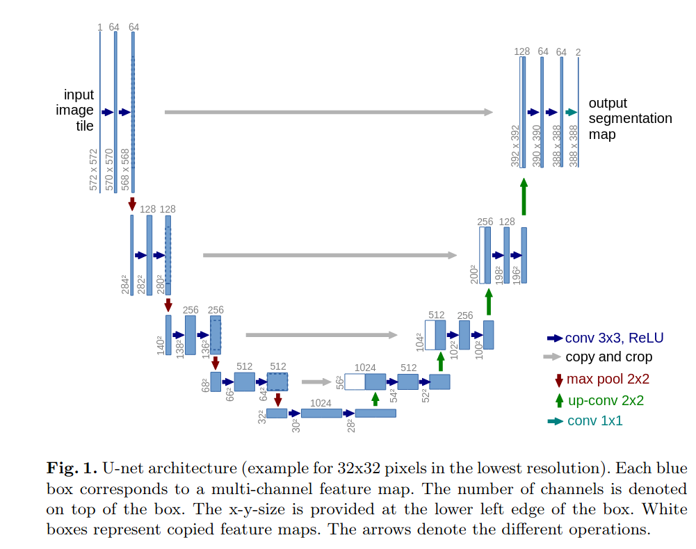
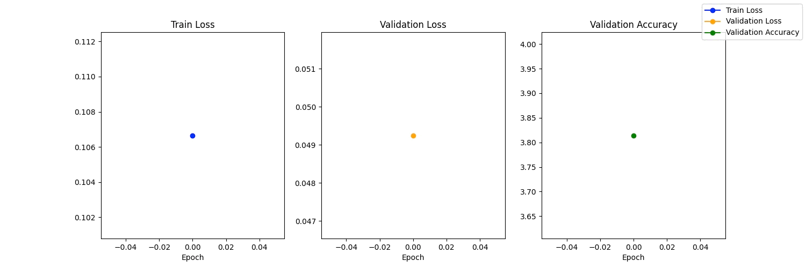
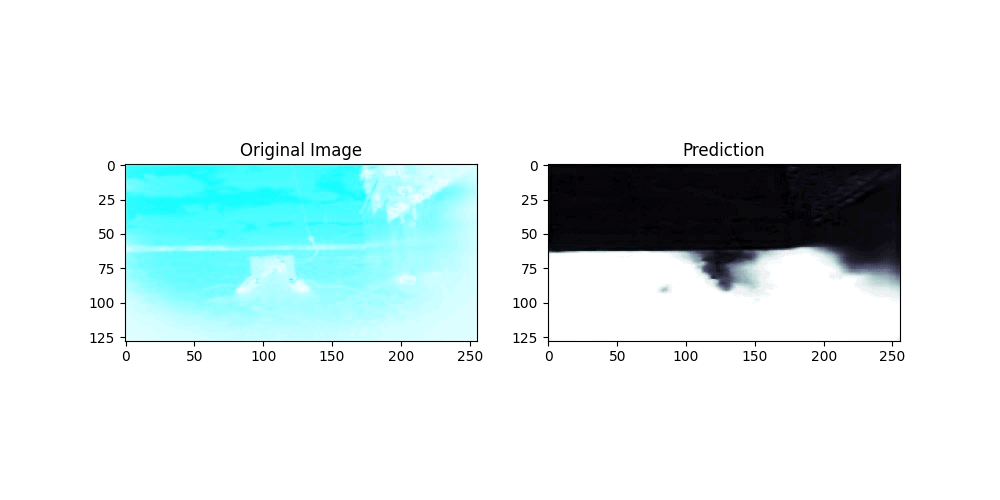

<h1 align="center">Horizon Segmentation for Autonomous Surface Drones</h1>

<div align="center">

</div>


## Objective:

The objective is to training and testing semantic segmentation model (Variation of U-Net) on Horizon Dataset by Exail Technologies. 


## U-Net:

UNet is a convolutional neural network architecture designed for biomedical image segmentation tasks, particularly in medical image analysis. Proposed by Olaf Ronneberger, Philipp Fischer, and Thomas Brox in 2015, UNet is characterized by its U-shaped architecture, featuring a contracting path followed by an expansive path. The contracting path consists of convolutional and pooling layers, gradually reducing the spatial dimensions of the input while increasing its depth. The expansive path then consists of upsampling and convolutional layers, progressively restoring the spatial dimensions to produce a segmentation map. UNet's skip connections between corresponding layers in the contracting and expansive paths facilitate precise localization and segmentation by preserving high-resolution features. 

<div align="center">

</div>

## Dataset:

* Training: 7191 pairs of Images and Masks
* Validation: 3595 pairs of Images and Masks
* Testing: 1198 pairs of Images and Masks

## Evaluation metric:

The Dice similarity coefficient, also known as Dice score or Dice index, is used as an evaluation metric in this project. It measures the similarity between two sets of data, often used to assess the performance of a segmentation algorithm by comparing the overlap between the predicted segmentation mask and the ground truth mask. The Dice score ranges from 0 to 1, where a score of 1 indicates perfect overlap between the predicted and ground truth masks, while a score of 0 indicates no overlap. It is defined as the ratio of twice the intersection of the predicted and ground truth masks to the sum of the sizes of both masks.

The formula for Dice score is:

$$\text{Dice score} = \frac{2 \times | \text{Predicted} \cap \text{Ground Truth} |}{| \text{Predicted} | + | \text{Ground Truth} |} 
$$
A higher Dice score indicates better segmentation accuracy, with 1 being the ideal score. However, the Dice score may not always provide a complete picture of segmentation performance, especially when dealing with class imbalance or when a small area of interest needs to be segmented accurately. Therefore, it is often used in conjunction with other metrics such as sensitivity, specificity, and intersection over union (IoU) for a more comprehensive evaluation.

## Training:

The model is being trained with the hyperparameters given below:

```
learning_rate = 1e-4, 
batch_size = 4,
epoch_numbers = 50
```

<div align="center">

</div>

## Results:

<div align="center">

</div>

More validation images are available at: `/Validation`

For further information regarding the project, please refer to the accompanying report and code.
